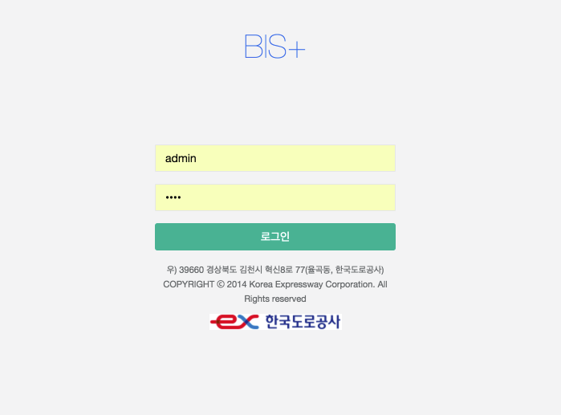
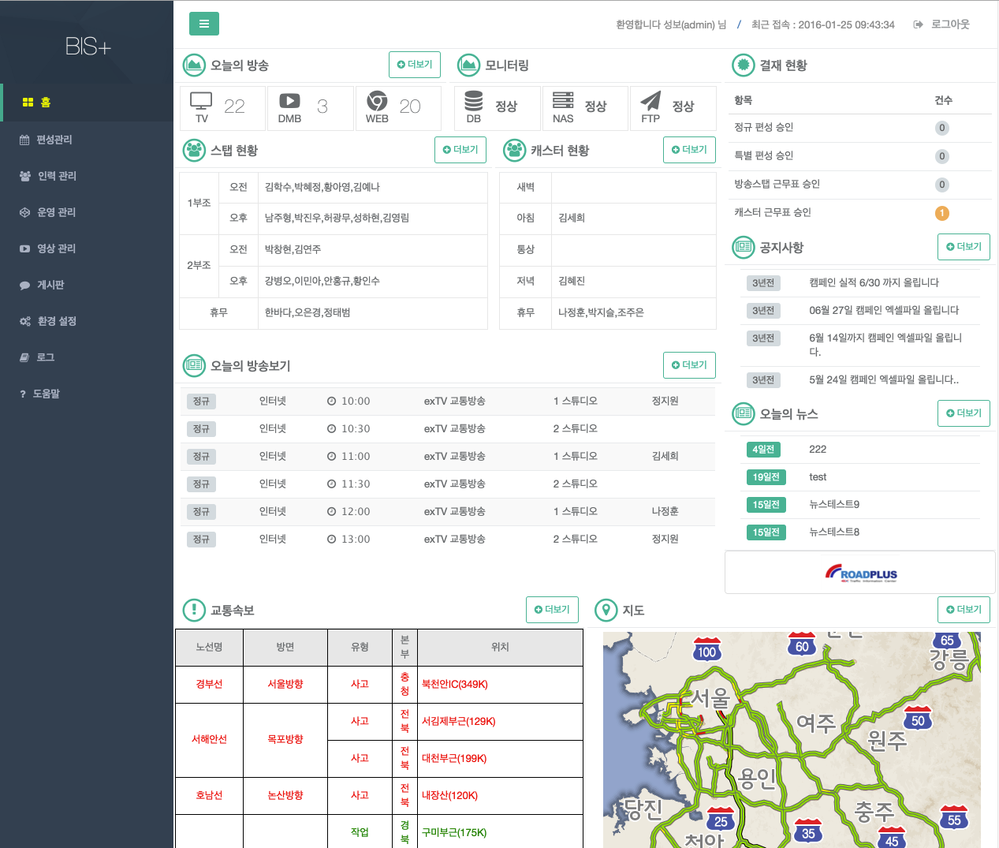

# 초기 접속 방법 및 홈 화면 구성

1. 접속 URL(http://10.152.5.61) 을 웹브라우저의 주소창에 입력한다.

1. 로그인 화면이 표시 된다.

    

1. 로그인창에서 사용자 id 와 패스워드를 입력 한다.

1. 로그인 하면 홈화면이 나타나며 아래와 같은 기능을 제공한다.

    

    - 홈 화면

        각 항목의 더보기 버튼을 누르면 해당화면으로 이동 가능합니다.
        
        - 매뉴 : 좌측에 시스템 매뉴가 나타난다. 방송운영 주요업무 이동에 사용된다.
        - 로그인 사용자 정보 : 우측 상단 로그인 사용자 정보가 출력 된다.
        - 결제 현황 : 결재 요청정보가 보여진다.
        - 스태프/캐스터 현황 : 당일 근무자의 현황을 보여준다.
        - 오늘의  방송보기 : 현재 시간 이후의 편성표를 보여준다.
        - 교통속보 : 교통속보를 보여준다.
        - 지도 : 교통 지도를 보여준다.
        - 공지사항 / 오늘의 뉴스 : 공지사항, 오늘의 뉴스의 최근 게시물을 보여준다.
