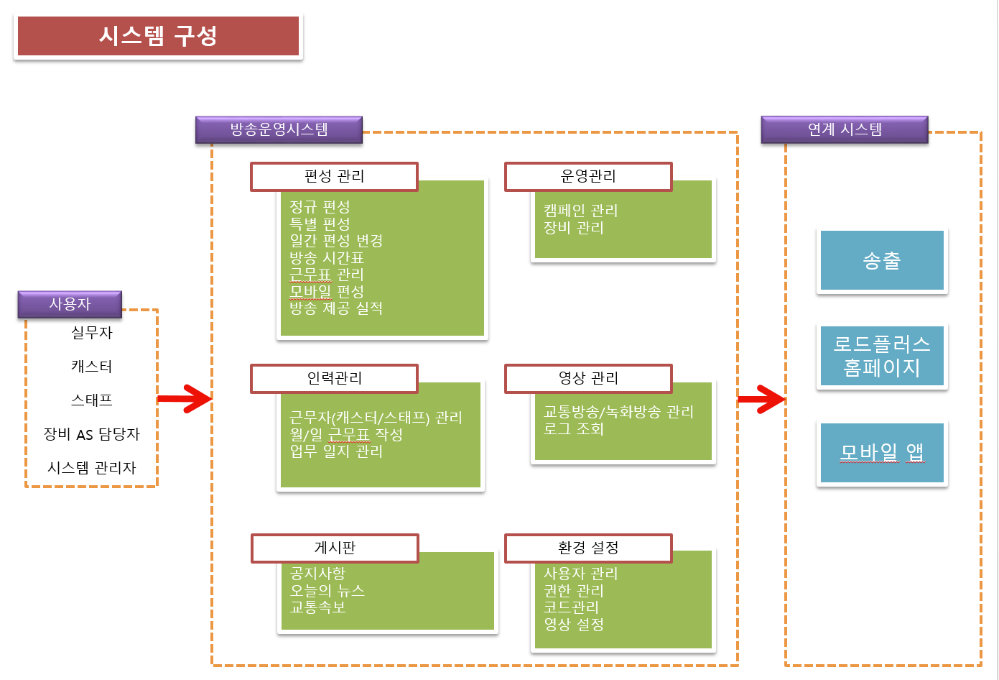
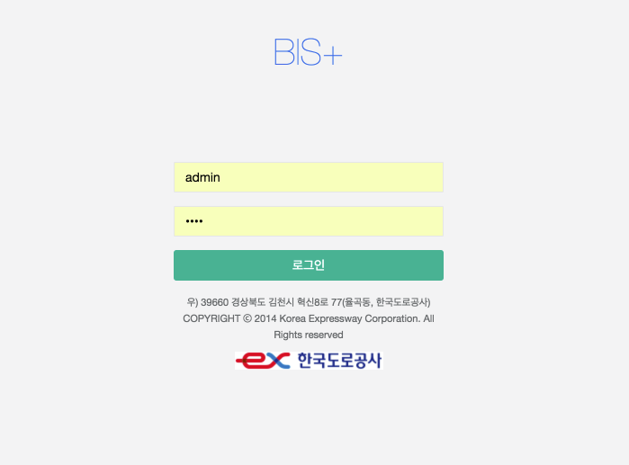
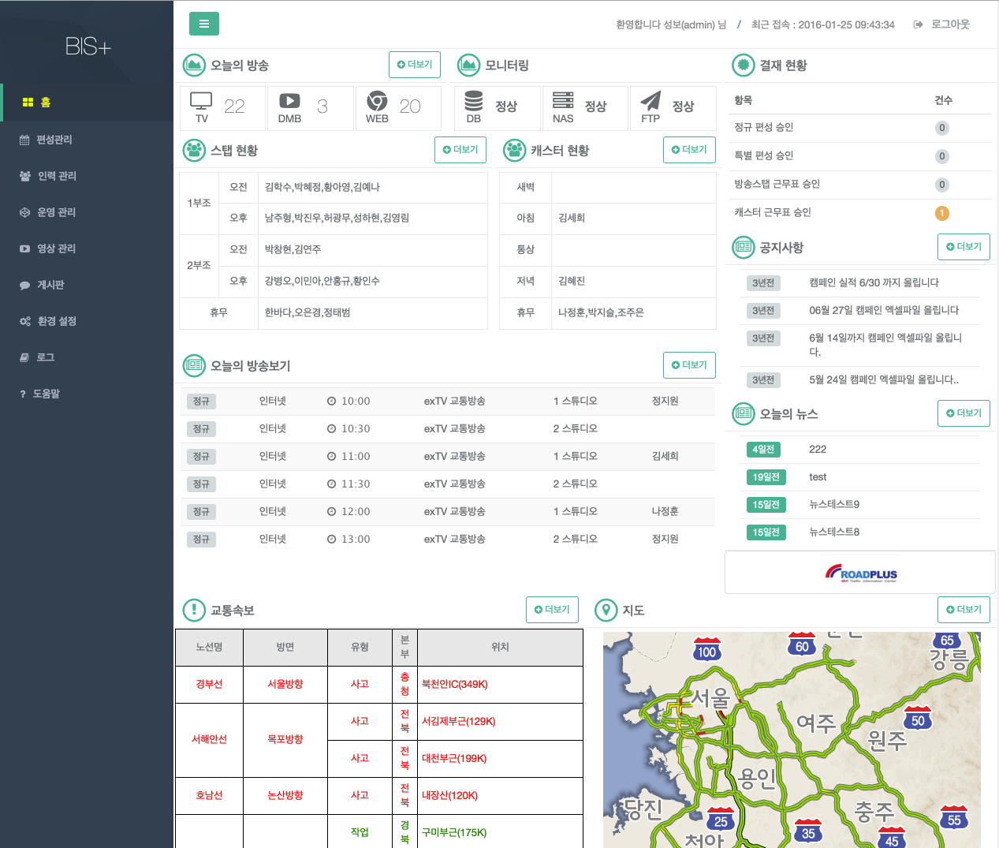

# 시스템 개요

1. 개요

	방송 운영 업무의 체계적인 통합관리로 보다 쉽게 편성 스케쥴 작성 및 근무자 배정을을 통해 
	사용자의 편의성을 중시하였고, 송출 시스템과의 원할한 연계 체계를 구축하여 방송의 안전성을 
	확보하며 또한 방송 장애에 대한 신속한 대응조치 및 다양한 통계 자료 제공으로 업무를 효율적으로
	수행 할 수 있도록 지원하는데 있다.
	
	- 사용을 위한 시스템 사양
		
		1. 사용자 PC   : 펜티엄급 이상, 메모리 2G 이상 권장
		1. 운영체제    : WINDOWS 7 이상 / MacOSX
		1. 접속 방법   : 내부망 접속
		1. 브라우저    : 구글 크롬 웹브라우저 / 인터넷 익스플로러 11 이상

1. 시스템 구성 및 현황

	
		
1. 주요 기능

	-  편성관리
	
		월간 편성표, 특별방송 편성표 그리고 일별로 편성 변경 처리업무를 관리 및 승인 처리 후 송출 시스템과의 연계로 보다 쉽게 편성관리 업무를 수행 할 수 있도록 기능을 제공 한다.

   - 인력관리
		
		캐스터, 스테프의 월 근무표 배분 처리 및 일별로 변경 관리를 할 수 있도록 기능을 제공 하며, 업무일지 작성 기능을 제공한다.

   - 운영관리

		방송 운영시 관리가 되고 있는 켐페인 내역에 대한 작성 및 조회 기능을 제공한다.
		장비에 대한 정보 관리 및 주간/수시 점검일 작성 및 조회 기능을 제공한다. 

   
    - 영상관리
		
		제공된 교통방송 및 녹화방송의 조회 및 로드플러스 웹/앱에서의 영상 게시 여부 관리 기능을 제공한다.
		
		녹화 방송 업로드 기능을 제공한다.
		
		업로드 및 배포에 대한 로그 열람 기능을 제공한다.

    - 게시판
    
		방송운영 시스템에 등록된 모든 회원이 사용 가능하고, 공지사항, 오늘의 뉴스를 제공한다.
		
		교통속보 내역 조회 기능을 제공한다.

    - 환경 설정
		
		사용자 관리, 공통코드 관리, 권한 관리, 권한별 메뉴관리등 시스템을 운영 하기 위한 등록 관리 기능을 제공 한다.		

	- 로그
	
		시스템 접속 내역을 열람하는 기능을 제공한다.
		
      
1. 초기 접속 방법 및 홈 화면 구성

    1. 접속 URL(http://10.152.5.61)을 웹브라우저의 주소창에 입력한다.

    1. 로그인 화면이 표시 된다.

	    

    1. 로그인창에서 사용자 id 와 패스워드를 입력 한다.

    1. 로그인 하면 홈화면이 나타나며 아래와 같은 기능을 제공한다.

	    

    	- 홈 화면

			각 항목의 더보기 버튼을 누르면 해당화면으로 이동 가능합니다.
			
			- 매뉴 : 좌측에 시스템 매뉴가 나타난다. 방송운영 주요업무 이동에 사용된다.
			- 로그인 사용자 정보 : 우측 상단 로그인 사용자 정보가 출력 된다.
			- 결제 현황 : 결재 요청정보가 보여진다.
			- 스탭/캐스터 현황 : 당일 근무자의 현황을 보여준다.
			- 오늘의  방송보기 : 현재 시간 이후의 편성표를 보여준다.
			- 교통속보 : 교통속보를 보여준다.
			- 지도 : 교통 지도를 보여준다.
	   		- 공지사항 / 오늘의 뉴스 : 공지사항, 오늘의 뉴스의 최근 게시물을 보여준다.
    