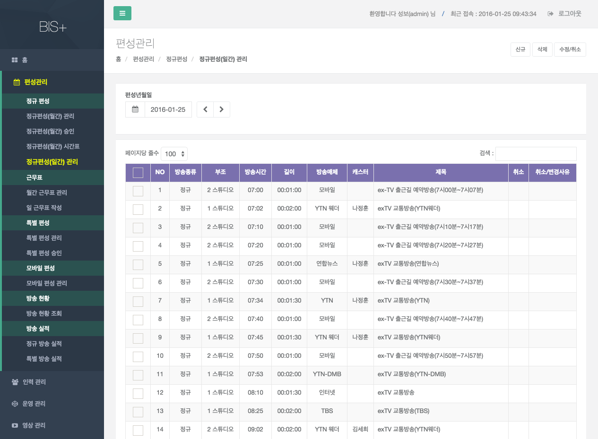

# 정규 편성

## 정규편성(월간) 관리

- 화면개요 : 매월 말일에 차월 방송 편성 계획을 수립하는 화면이다. 승인, 승인 요청을 제외한 경우에는 수정 및 추가 편성이 가능 하다. 

- 상단 매뉴

    

    - 현재 승인상태 (승인, 반려, 작업중)
    - 신규 : 신규 항목을 추가 할 경우 사용한다.
    - 삭제 : 항목을 삭제 할 경우 사용한다.
    - 승인요청 : 해당 월의 편성을 승인요청 할 경우 사용한다.
    - 월단위 복사 : 특정 월의 편성 내역을 복사하여 신규 생성할 경우 사용한다.

- 조회 항목 설명

    

    - 편성년월 : 수립하고자 하는 편성년월을 입력 한다(필수).
    - 편성구분 : 전체, 평일(월~금), 토요일, 일요일, 기타로 구분 된다.

            기타는 특정 요일에만 방송이 있는 경우 선택한다.

- 조회 처리

    검색하려는 조건을 입력 하면 검색이 됩니다.
    
    - 비고 : 편성계획이 수립이 되었으면 결과가 화면에 조회 되고, 없으면 빈 페이지 결과가 보여 준다

- 월단위 복사처리

    

    - 전월 편성계획을 차월에 그대로 복사를 한다.
    - [월단위 복사] 버튼을 클릭하면 복사 하기 위한 팝업창이 활성화 된다.
    - 생성년월을 입력 후 [복사] 버튼을 클릭하면 자동으로 복사 처리가 된다.
    - 해당 편성 월이 이미 승인되었을 경우에는 복사가 불가 하며, 작업 중일 경우에는  삭제 후 복사를 시도해야 한다.

- 추가편성 처리
    - 편성 추가를 하고자 할 경우는 하단 [신규] 버튼을 누르고 관련 데이타를 입력하고 [저장] 버튼을 누르면, DB에 저장이 되어 화면 상단에 다시 조회가 된다.
    -승인, 승인 요청 된 편성은 신규 추가 및 수정 편성을 할 수 없다. 

- 변경 처리

    
    - 변경시에는 조회 결과 중 [변경]버튼을 클릭하면, 해당 항목이 조회 되며, 이때 수정을 한 후 [저장] 버튼을 클릭하면 DB에 저장이 되어 상단에 다시 조회 된다.
    -승인, 승인 요청 된 편성은 변경 처리 할 수 없다. 

- 삭제 처리
    - 삭제시에는 조회 결과 중 삭제 할 편성을 체크 하여,  [삭제] 버튼을 클릭하면 삭제 된다. 
    - 승인, 승인 요청 된 편성은 삭제 처리 할 수 없다. 

- 결재 요청 처리

    

    - [승인요청] 버튼을 클릭 하면 결재권자 지정 하는 팝업창이 활성화 된다.

### 정규편성(월간) 승인
    

- 화면설명
    - 편성계획을 지정된 승인권자가 승인 및 반려를 처리 하는 화면이다.
    - 지정된 승인 권자가 아니면 승인 편성 계획이 보이지 않습니다.

- 조회 처리
    - 승인 상태별 조회가 가능합니다. 
    - 로그인 사용자에게 요청된 결재건만 화면에 조회가 된다.

- 승인 처리

    

    - 편성내용을 클릭 하면 결재 요청한 가 편성표가 조회되며, 승인 또는 반려 버튼을 클릭하여 승인/반려 처리가 가능합니다.

## 정규편성(월간) 시간표

  

- 화면설명
    - 정규편성(월간) 시간표를 조회하는 화면이다.
- 조회 처리
    - 편성년월을 선택하면 해당 월의 시간표가 조회된다.
- 파일 저장
    - 파일 저장 버튼을 누르면, 엑셀파일로 저장된다.
          
## 정규편성(일간) 관리

- 화면개요

    - 일편성 변경을 처리 하는 화면이다.  
    - 승인, 승인 요청을 제외한 경우에는 수정 및 추가 편성이 가능 하다.

- 조회 처리
    
    - 편성년월일을 선택하면 결과가 화면에 조회된다.
    
        - 비고 : 편성계획이 수립이 되었으면 결과가 화면에 조회 되고, 없으면 빈 페이지 결과가 보여 준다
            
- 추가 처리
    - 편성 추가를 하고자 할 경우는 [신규] 버튼을 누르고 관련 데이타를 입력하고 [저장] 버튼을 누르면, DB에 저장이 되어 화면 상단에 다시 조회가 된다.
    
    -승인, 승인 요청 된 편성은 신규 추가 및 수정 편성을 할 수 없다. 

- 변경 처리

    - 변경시에는 수정할 항목을 선택 한 후, [수정/취소] 버튼을 누르면 해당 항목이 조회 되며, 이때 수정 한 후 [저장] 버튼을 클릭하면 저장이 된다.
    -승인, 승인 요청 된 편성은 변경 처리 할 수 없다. 
    
- 삭제 처리

    - 삭제시에는 조회 결과 중 삭제 할 편성을 체크 하여,  [삭제] 버튼을 클릭하면 삭제 된다. 
    - 승인, 승인 요청 된 편성은 삭제 처리 할 수 없다. 

