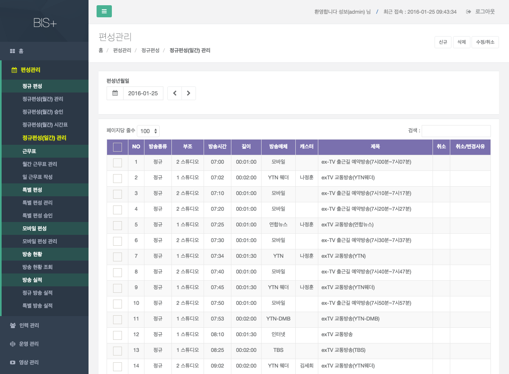
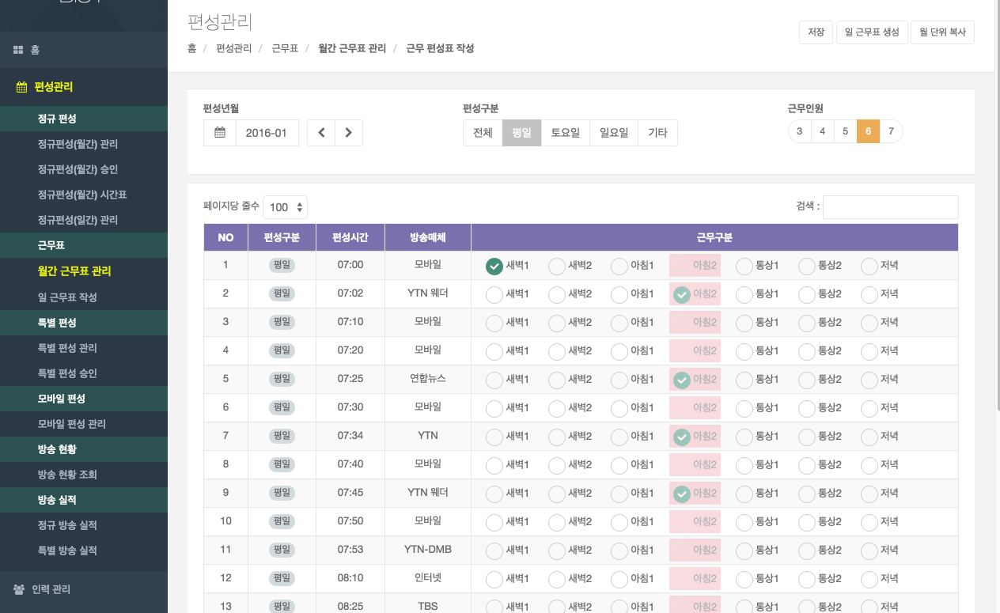
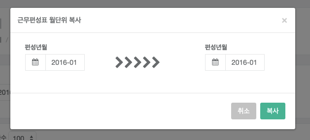
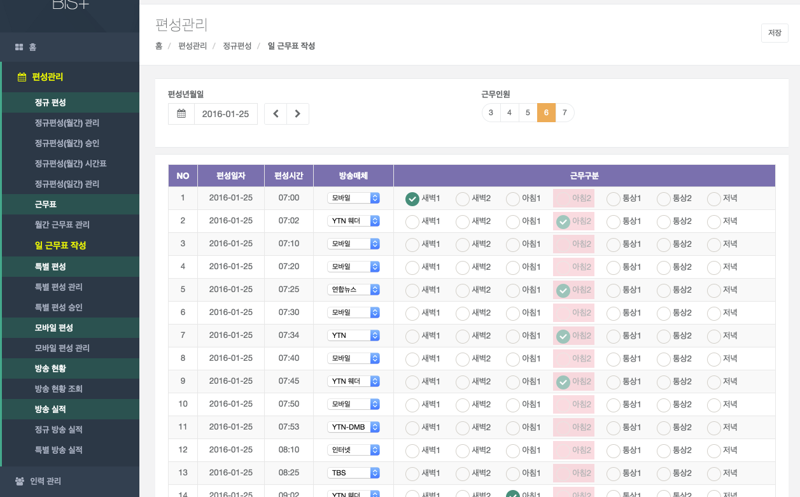

#근무표

## 월간 근무표 관리

정규 편성계획에 따른 캐스터별 근무구분별 편성표를 월 1회 편성구분(평일/토요일/일요일/기타)별로 조회 하는 화면이다.

편성년월 및 편성구분(평일/토요일/일요일/기타) 별로  조회 기능을 제공한다.
    
## 근무 편성표 작성 

월간 근무표 관리에서 `근무편성표작성` 버튼을 눌러 근무 편성표 작성 화면으로 이동한다.

- 화면설명
    - 정규 편성계획에 따른 캐스터별 근무구분별 편성표를 월 1회 편성구분(평일/토요일/일요일)별로 관리 하는 화면이다.

- 검색 항목
    - 편성년월 : 편성하고자 하는 년월
    - 편성구분 : 평일(월~금), 토요일, 일요일

- 근무인원 : 일 근무인원수에 따라 근무구분을을 표시한다.
    
    편성 구분에 따라, 평일(6인), 토요일 (4인), 일요일 (3인)으로 근무인원이 자동선택된다.

- 월단위 복사

    

    - 이전에 작성된 월간 근무표 내역을 복사한다. (단, 평성구분, 편성시간, 방송매체가 동일한 경우에만 복사된다.) 

- 조회 처리
    - 검색 조건에 맞는 정보가 화면에 조회 된다.

- 저장 처리
    - 조회된 결과에서 근무구분을 변경 또는 추가로 선택된 건을 저장 처리 한다.

- 일별생성 처리
    - 월별 편성구분(평일/토요일/일요일)별로 작성된 자료를 일 단위별로 캐스터 근무구분별로 자동 생성 처리 한다. (정규 편성계획 수립후 월 1회 작업 수행을 한다)  

## 일 근무표 작성

- 화면설명
    - 일 편성계획에 따른 일자별 캐스터별 근무구분별 편성표를 관리 하는 화면이다.
    - 송출시스템에서 추가로 편성된 정보에 대한 근무구분별 캐스터 및 방송매체 정보를 매핑 처리 하는 화면이다.

- 검색 항목
    - 편성일자 : 편성된 일자
    - 근무인원 : 일 근무인원수를 선택 한다.

- 조회 처리
    - 검색 조건에 맞는 정보가 화면에 조회 된다.

- 저장 처리
    - 조회된 결과에서 근무구분을 변경 또는 추가 및 방송매체를 선택 후 [저장]버튼을 클릭하면 저장된다.

