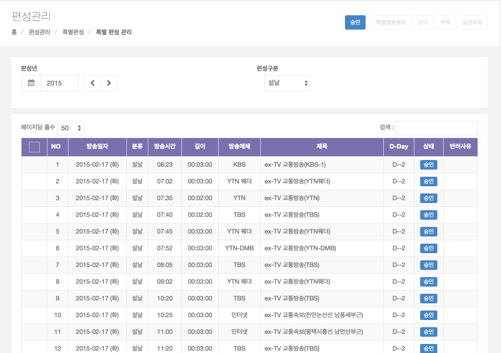
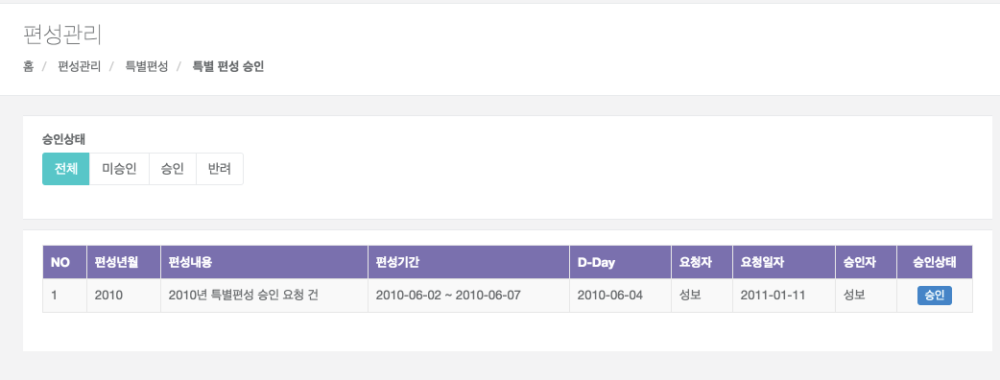

# 특별 편성

## 특별 편성 관리

- 화면개요

    - 특별편성 계획을 수립하는 화면이다.(설날, 추석, 석가탄신일, 성탄절) 
    - 승인, 승인 요청을 제외한 경우에는 수정 및 추가 편성이 가능 하다.

- 검색항목 설명

    - 편성작성년 :  수립하고자 하는 편성년을 선택 한다(필수).
    - 분류 : 설날, 추석, 석가탄신일, 성탄절등의 분류를 선택한다.

- 조회 처리

    - 검색하려는 조건을 입력 및 선택을 하면 조회된다.
    ※ 편성계획이 수립이 되었으면 결과가 화면에 조회 되고, 없으면 빈 페이지 결과가 보여 준다

- 특별 편성 생성 처리

    

    - 특별 편성 추가를 하고자 할 경우는 상단의 [특별방송생성] 버튼을 누르면 생성 팝업 창이 활성화 되어 특별 편성 기간을 생성 할 수 있다.
    - 특별 편성 생성은 특별방송 기간, 특별편성분류, D-DAY를 등록 및 선택 하여 [생성] 버튼을 누르면 특별 편성이 생성 된다. 

- 추가편성 처리

    - 편성 추가를 하고자 할 경우는 하단 [신규] 버튼을 누르고 관련 데이타를 입력하고 [저장] 버튼을 누르면, DB에 저장이 되어 화면 상단에 다시 조회가 된다.
    - 승인, 승인 요청 된 편성은 신규 추가 및 수정 편성을 할 수 없다. 

- 변경 처리
    - 변경시에는 조회 결과 중 제목을 클릭하면, 해당 데이타가 화면 하단에 조회 되며, 이때 수정을
    한 후 [저장] 버튼을 클릭하면 DB에 저장이 되어 상단에 다시 조회 된다.
    - 승인, 승인 요청 된 편성은 변경 처리 할 수 없다. 

- 삭제 처리
    - 삭제시에는 조회 결과 중 삭제 할 편성을 체크 하여,  [삭제] 버튼을 클릭하면 삭제 된다. 
    - 승인, 승인 요청 된 편성은 삭제 처리 할 수 없다. 

- 결재 요청 처리
    - [승인요청] 버튼을 클릭 하면 결재권자 지정 하는 팝업창이 활성화 된다.

## 특별 편성 승인

- 화면설명
    - 편성계획을 지정된 승인권자가 승인 및 반려를 처리 하는 화면이다.
    - 지정된 승인 권자가 아니면 승인 편성 계획이 보이지 않습니다.

- 조회 처리
    - 승인 상태별 조회가 가능합니다. 
    - 로그인 사용자에게 요청된 결재건만 화면에 조회가 된다.

- 승인 처리
    - 편성내용을 클릭 하면 결재 요청한 가 편성표가 조회되며, 승인 또는 반려 버튼을 클릭하여 승인/반려 처리가 가능합니다.

