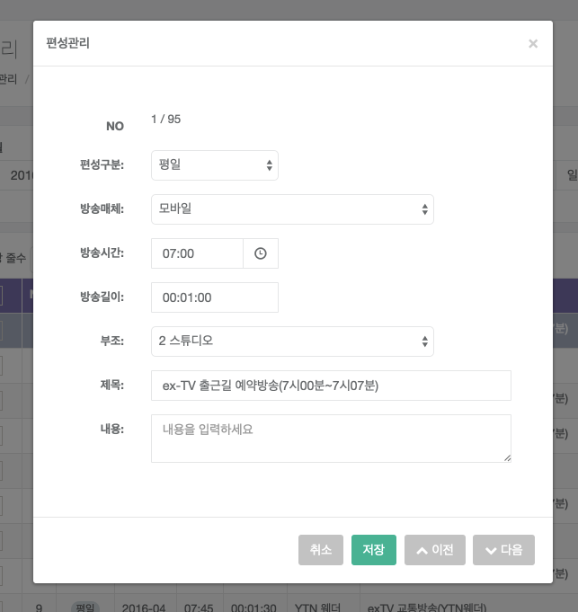
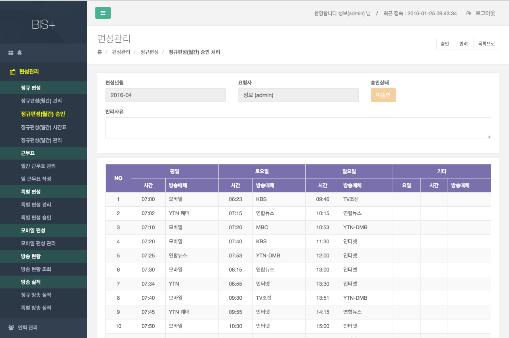
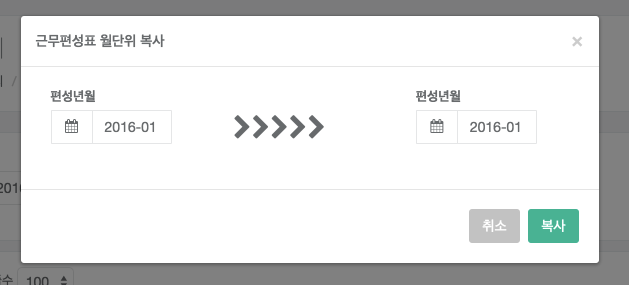
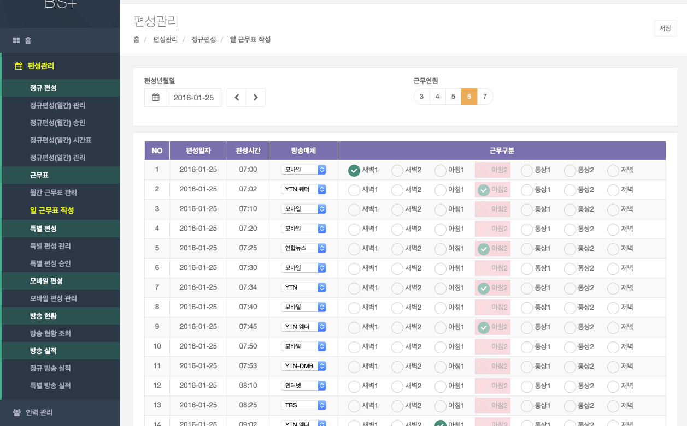
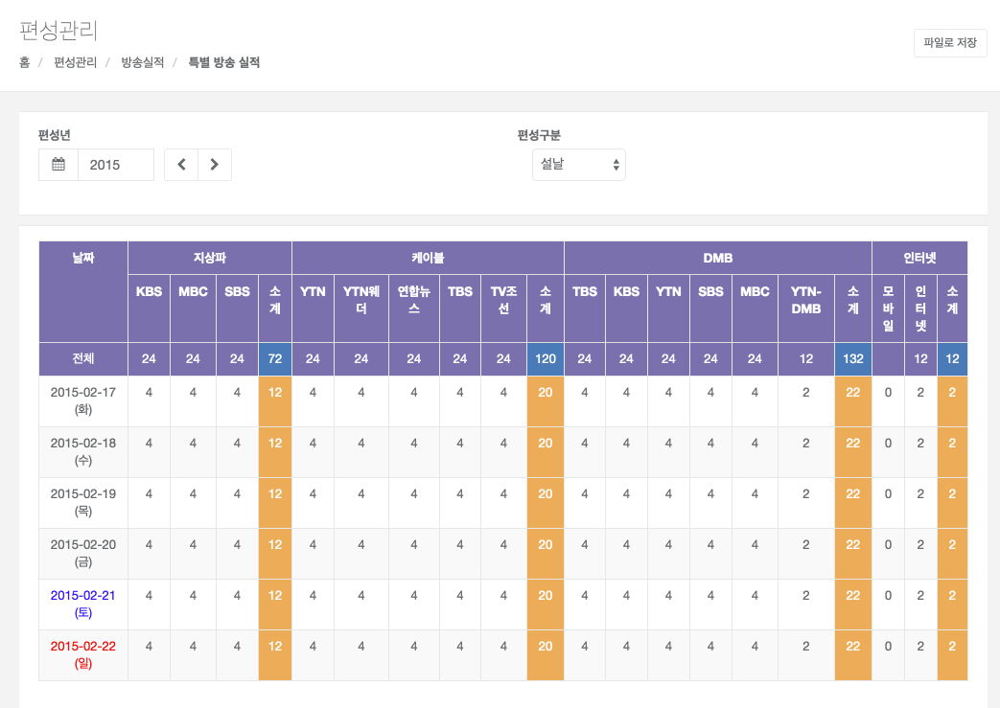

# 편성관리

1. 업무처리절차

	

1. 주요 화면

	- 정규 편성
	  - 정규편성(월간) 관리
	  - 정규편성(월간) 승인
	  - 정규편성(월간) 시간표
	  - 정규편성(일간) 관리
	- 근무표
	  - 월간 근무표 관리
	  - 일 근무표 작성
	- 특별 편성
	  - 특별 편성 관리
	  - 특별 편성 승인
	- 모바일 편성
	  - 모바일 편성 관리
	- 방송 현황
	  - 방송 현황 조회
	- 방송 실적
	  - 정규 방송 실적
	  - 특별 방송 실적

1. 정규 편성
	1. 정규편성(월간) 관리

		
	
		- 화면개요 : 매월 말일에 차월 방송 편성 계획을 수립하는 화면이다. 승인, 승인 요청을 제외한 경우에는 수정 및 추가 편성이 가능 하다. 
		
		- 상단 매뉴

			
		
			- 현재 승인상태 (승인, 반려, 작업중)
			- 신규 : 신규 항목을 추가 할 경우 사용한다.
			- 삭제 : 항목을 삭제 할 경우 사용한다.
			- 승인요청 : 해당 월의 편성을 승인요청 할 경우 사용한다.
			- 월단위 복사 : 특정 월의 편성 내역을 복사하여 신규 생성할 경우 사용한다.
		
		- 조회 항목 설명

			
		
			- 편성년월 : 수립하고자 하는 편성년월을 입력 한다(필수).
			- 편성구분 : 전체, 평일(월~금), 토요일, 일요일, 기타로 구분 된다.
	
					기타는 특정 요일에만 방송이 있는 경우 선택한다.

		- 조회 처리
		
			검색하려는 조건을 입력 하면 검색이 됩니다.
			
			- 비고 : 편성계획이 수립이 되었으면 결과가 화면에 조회 되고, 없으면 빈 페이지 결과가 보여 준다

		- 월단위 복사처리

			
		
			- 전월 편성계획을 차월에 그대로 복사를 한다.
			- [월단위 복사] 버튼을 클릭하면 복사 하기 위한 팝업창이 활성화 된다.
			- 생성년월을 입력 후 [복사] 버튼을 클릭하면 자동으로 복사 처리가 된다.
			- 해당 편성 월이 이미 승인되었을 경우에는 복사가 불가 하며, 작업 중일 경우에는  삭제 후 복사를 시도해야 한다.

		- 추가편성 처리
			- 편성 추가를 하고자 할 경우는 하단 [신규] 버튼을 누르고 관련 데이타를 입력하고 [저장] 버튼을 누르면, DB에 저장이 되어 화면 상단에 다시 조회가 된다.
			-승인, 승인 요청 된 편성은 신규 추가 및 수정 편성을 할 수 없다. 

		- 변경 처리

			
			- 변경시에는 조회 결과 중 [변경]버튼을 클릭하면, 해당 항목이 조회 되며, 이때 수정을 한 후 [저장] 버튼을 클릭하면 DB에 저장이 되어 상단에 다시 조회 된다.
			-승인, 승인 요청 된 편성은 변경 처리 할 수 없다. 

		- 삭제 처리
			- 삭제시에는 조회 결과 중 삭제 할 편성을 체크 하여,  [삭제] 버튼을 클릭하면 삭제 된다. 
			- 승인, 승인 요청 된 편성은 삭제 처리 할 수 없다. 

		- 결재 요청 처리

			
		
			- [승인요청] 버튼을 클릭 하면 결재권자 지정 하는 팝업창이 활성화 된다.

  1. 정규편성(월간) 승인
		
		
  
		- 화면설명
			- 편성계획을 지정된 승인권자가 승인 및 반려를 처리 하는 화면이다.
			- 지정된 승인 권자가 아니면 승인 편성 계획이 보이지 않습니다.

		- 조회 처리
			- 승인 상태별 조회가 가능합니다. 
			- 로그인 사용자에게 요청된 결재건만 화면에 조회가 된다.

		- 승인 처리

			
		
			- 편성내용을 클릭 하면 결재 요청한 가 편성표가 조회되며, 승인 또는 반려 버튼을 클릭하여 승인/반려 처리가 가능합니다.
  
  1. 정규편성(월간) 시간표

		  
  
		- 화면설명
			- 정규편성(월간) 시간표를 조회하는 화면이다.
		- 조회 처리
			- 편성년월을 선택하면 해당 월의 시간표가 조회된다.
		- 파일 저장
			- 파일 저장 버튼을 누르면, 엑셀파일로 저장된다.
			  
  1. 정규편성(일간) 관리

		
		- 화면개요

			- 일편성 변경을 처리 하는 화면이다.  
			- 승인, 승인 요청을 제외한 경우에는 수정 및 추가 편성이 가능 하다.
		
		- 조회 처리
			
			- 편성년월일을 선택하면 결과가 화면에 조회된다.
		   	
				- 비고 : 편성계획이 수립이 되었으면 결과가 화면에 조회 되고, 없으면 빈 페이지 결과가 보여 준다
				   	
		- 추가 처리
			- 편성 추가를 하고자 할 경우는 [신규] 버튼을 누르고 관련 데이타를 입력하고 [저장] 버튼을 누르면, DB에 저장이 되어 화면 상단에 다시 조회가 된다.
			
			-승인, 승인 요청 된 편성은 신규 추가 및 수정 편성을 할 수 없다. 
		
		- 변경 처리

			- 변경시에는 수정할 항목을 선택 한 후, [수정/취소] 버튼을 누르면 해당 항목이 조회 되며, 이때 수정 한 후 [저장] 버튼을 클릭하면 저장이 된다.
			-승인, 승인 요청 된 편성은 변경 처리 할 수 없다. 
			
		- 삭제 처리

			- 삭제시에는 조회 결과 중 삭제 할 편성을 체크 하여,  [삭제] 버튼을 클릭하면 삭제 된다. 
			- 승인, 승인 요청 된 편성은 삭제 처리 할 수 없다. 

  
1. 근무표
	1. 월간 근무표 관리

		
	  
		정규 편성계획에 따른 캐스터별 근무구분별 편성표를 월 1회 편성구분(평일/토요일/일요일/기타)별로 조회 하는 화면이다.
		
		편성년월 및 편성구분(평일/토요일/일요일/기타) 별로  조회 기능을 제공한다.
		
	1. 근무 편성표 작성 

		월간 근무표 관리에서 `근무편성표작성` 버튼을 눌러 근무 편성표 작성 화면으로 이동한다.
		
		
	
		- 화면설명
			- 정규 편성계획에 따른 캐스터별 근무구분별 편성표를 월 1회 편성구분(평일/토요일/일요일)별로 관리 하는 화면이다.
		
		- 검색 항목
			- 편성년월 : 편성하고자 하는 년월
			- 편성구분 : 평일(월~금), 토요일, 일요일
		
		- 근무인원 : 일 근무인원수에 따라 근무구분을을 표시한다.
			
			편성 구분에 따라, 평일(6인), 토요일 (4인), 일요일 (3인)으로 근무인원이 자동선택된다.
		
		- 월단위 복사

			
		
			- 이전에 작성된 월간 근무표 내역을 복사한다. (단, 평성구분, 편성시간, 방송매체가 동일한 경우에만 복사된다.) 
		
		- 조회 처리
			- 검색 조건에 맞는 정보가 화면에 조회 된다.
		
		- 저장 처리
			- 조회된 결과에서 근무구분을 변경 또는 추가로 선택된 건을 저장 처리 한다.
		
		- 일별생성 처리
			- 월별 편성구분(평일/토요일/일요일)별로 작성된 자료를 일 단위별로 캐스터 근무구분별로 자동 생성 처리 한다. (정규 편성계획 수립후 월 1회 작업 수행을 한다)  
  
  1. 일 근무표 작성

	

	- 화면설명
		- 일 편성계획에 따른 일자별 캐스터별 근무구분별 편성표를 관리 하는 화면이다.
		- 송출시스템에서 추가로 편성된 정보에 대한 근무구분별 캐스터 및 방송매체 정보를 매핑 처리 하는 화면이다.
	
	- 검색 항목
		- 편성일자 : 편성된 일자
		- 근무인원 : 일 근무인원수를 선택 한다.
	
	- 조회 처리
		- 검색 조건에 맞는 정보가 화면에 조회 된다.
	
	- 저장 처리
		- 조회된 결과에서 근무구분을 변경 또는 추가 및 방송매체를 선택 후 [저장]버튼을 클릭하면 저장된다.
  
1. 특별 편성

  1. 특별 편성 관리

	  

		- 화면개요
		
			- 특별편성 계획을 수립하는 화면이다.(설날, 추석, 석가탄신일, 성탄절) 
			- 승인, 승인 요청을 제외한 경우에는 수정 및 추가 편성이 가능 하다.
		
		- 검색항목 설명
		
			- 편성작성년 :  수립하고자 하는 편성년을 선택 한다(필수).
			- 분류 : 설날, 추석, 석가탄신일, 성탄절등의 분류를 선택한다.
		
		- 조회 처리
		
			- 검색하려는 조건을 입력 및 선택을 하면 조회된다.
			※ 편성계획이 수립이 되었으면 결과가 화면에 조회 되고, 없으면 빈 페이지 결과가 보여 준다
		
		- 특별 편성 생성 처리

			
		
			- 특별 편성 추가를 하고자 할 경우는 상단의 [특별방송생성] 버튼을 누르면 생성 팝업 창이 활성화 되어 특별 편성 기간을 생성 할 수 있다.
			- 특별 편성 생성은 특별방송 기간, 특별편성분류, D-DAY를 등록 및 선택 하여 [생성] 버튼을 누르면 특별 편성이 생성 된다. 
		
		- 추가편성 처리
		
			- 편성 추가를 하고자 할 경우는 하단 [신규] 버튼을 누르고 관련 데이타를 입력하고 [저장] 버튼을 누르면, DB에 저장이 되어 화면 상단에 다시 조회가 된다.
			- 승인, 승인 요청 된 편성은 신규 추가 및 수정 편성을 할 수 없다. 
		
		- 변경 처리
			- 변경시에는 조회 결과 중 제목을 클릭하면, 해당 데이타가 화면 하단에 조회 되며, 이때 수정을
			한 후 [저장] 버튼을 클릭하면 DB에 저장이 되어 상단에 다시 조회 된다.
			- 승인, 승인 요청 된 편성은 변경 처리 할 수 없다. 
		
		- 삭제 처리
			- 삭제시에는 조회 결과 중 삭제 할 편성을 체크 하여,  [삭제] 버튼을 클릭하면 삭제 된다. 
			- 승인, 승인 요청 된 편성은 삭제 처리 할 수 없다. 
		
		- 결재 요청 처리
			- [승인요청] 버튼을 클릭 하면 결재권자 지정 하는 팝업창이 활성화 된다.
 
 
	1. 특별 편성 승인

		

		- 화면설명
			- 편성계획을 지정된 승인권자가 승인 및 반려를 처리 하는 화면이다.
			- 지정된 승인 권자가 아니면 승인 편성 계획이 보이지 않습니다.

		- 조회 처리
			- 승인 상태별 조회가 가능합니다. 
			- 로그인 사용자에게 요청된 결재건만 화면에 조회가 된다.

		- 승인 처리
			- 편성내용을 클릭 하면 결재 요청한 가 편성표가 조회되며, 승인 또는 반려 버튼을 클릭하여 승인/반려 처리가 가능합니다.

1. 모바일 편성

  1. 모바일 편성 관리

		
  
		- 화면설명
			- 모바일 편성을 관리하는 화면입니다.
		- 조회 처리
			- 방송노선, 요일유형, 방송시간대별 조회가 가능합니다. 

		- 추가편성 처리

			

			- 편성 추가를 하고자 할 경우는  [신규] 버튼을 누르고 관련 데이타를 입력하고 [저장] 버튼을 누르면 저장 됩니다.
		
		- 변경 처리

			
		
			- 항목을 선택 후 [수정] 버튼을 누른  후, 수정 작업을 진행하고 [저장] 버튼을 누르면 저장 됩니다.
		
		- 삭제 처리
			- 항목을 선택 후 [삭제] 버튼을 누르면 삭제 됩니다.

1. 방송 현황

  1. 방송 현황 조회

	  

		- 화면설명
			- 일자별 방송 현황을 조회하는 화면입니다.

		- 조회 처리
			- 일자별 조회가 가능합니다. 

1. 방송 실적

  1. 정규 방송 실적

	  

		- 화면설명
			- 정규 방송 실적을 기간별로 조회하는 화면입니다.

		- 조회 처리
			- 기간별 조회가 가능합니다. 		

		- 파일 저장
			- 파일 저장 버튼을 누르면, 엑셀파일로 저장된다.			

  1. 특별 방송 실적

	  
   
		- 화면설명
			- 특별 방송 실적을 종류별로 조회하는 화면입니다.

		- 조회 처리

			- 특별방송 편성구분 조회가 가능합니다. 	

		- 파일 저장

			- 파일 저장 버튼을 누르면, 엑셀파일로 저장된다.   
   