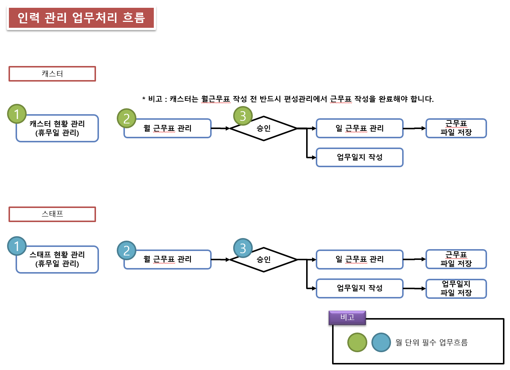

# 업무처리절차 및 주요 화면

## 업무처리절차

## 주요 화면

- 캐스터
    - 캐스터 현황 : (휴무일 등록 관리) 휴무일은 매년 1회 등록 관리를 해야 함.
    - 월 근무표 관리 : 월근무표 작성
    - 월 근무표 승인 : 월근무표 승인 처리
    - 일 근무표 관리 : 일근무표 작성
    - 업무 일지 관리 : 업무일지 작성
- 스태프
    - 스태프 현황 : (휴무일 등록 관리) 휴무일은 매년 1회 등록 관리를 해야 함.
    - 월 근무표 관리 : 월근무표 작성
    - 월 근무표 승인 : 월근무표 승인 처리
    - 일 근무표 관리 : 일근무표 작성
    - 업무 일지 관리 : 업무일지 작성
