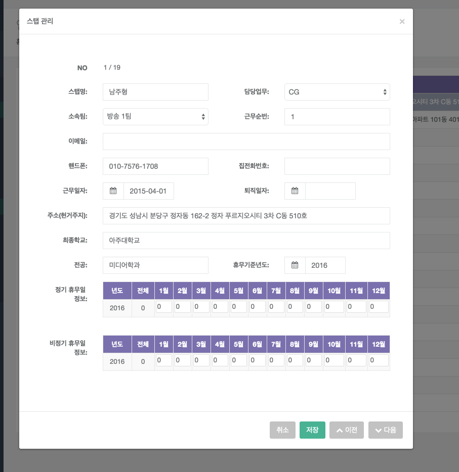
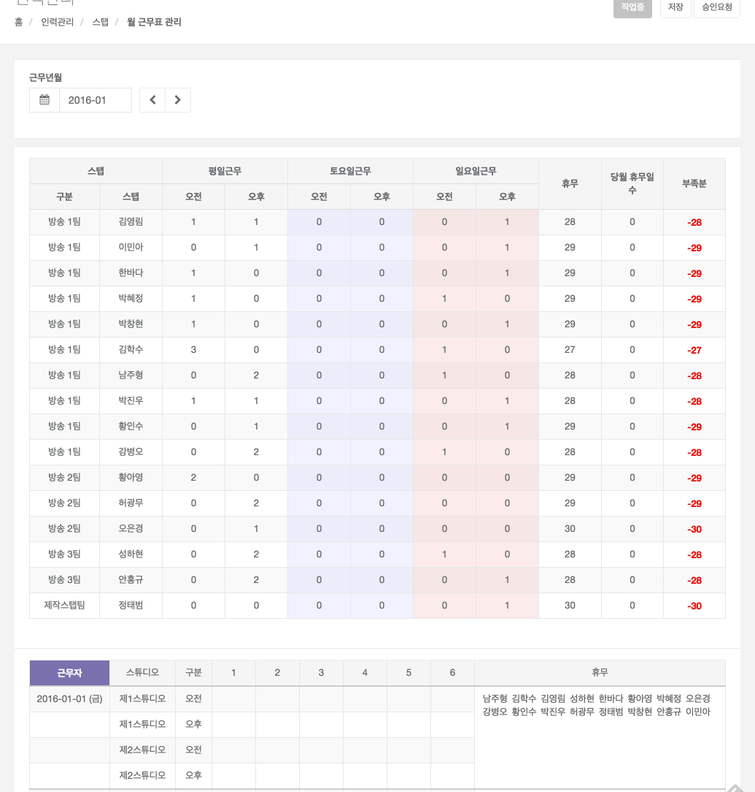
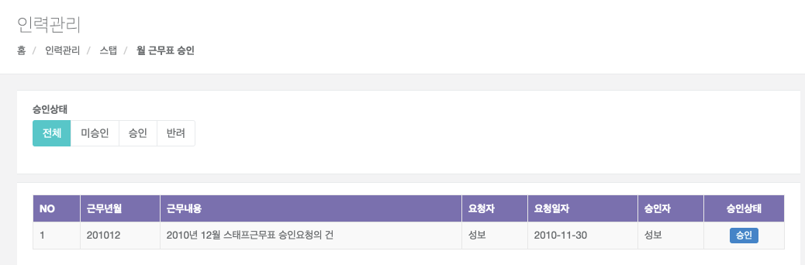
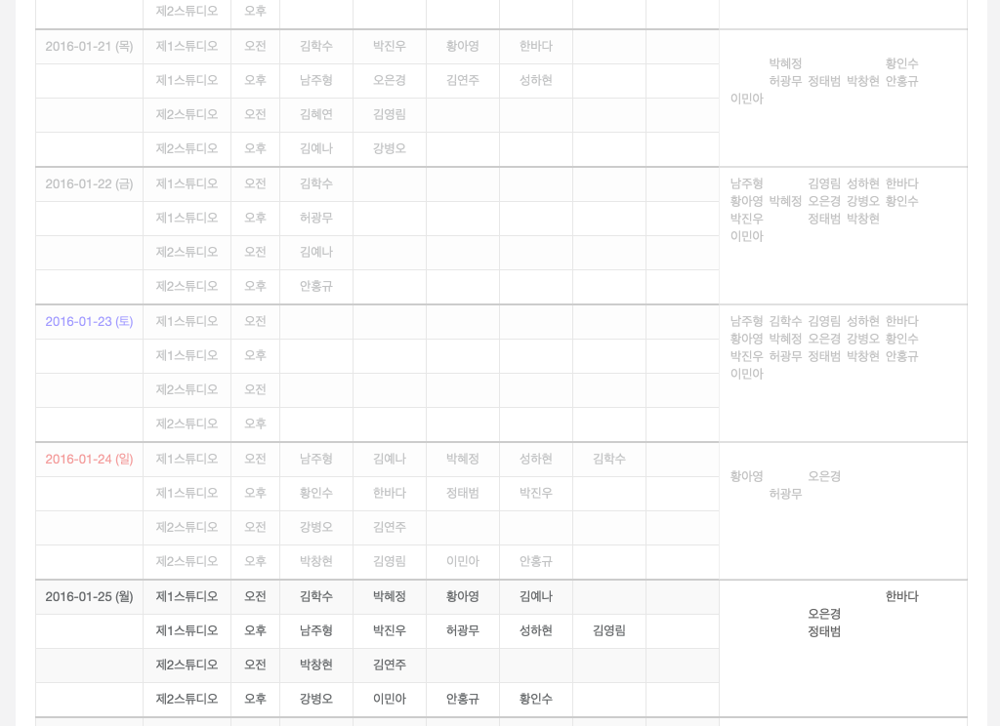
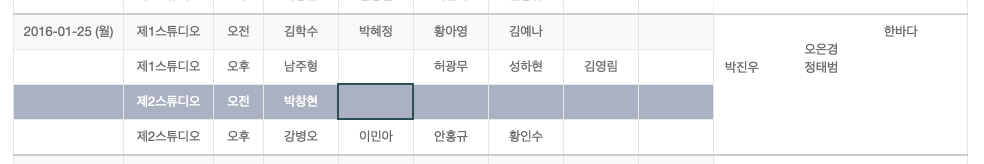
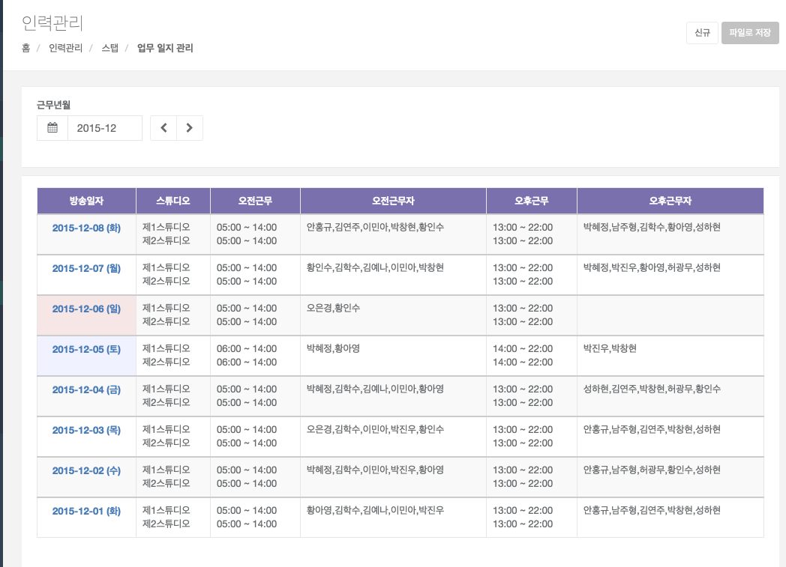
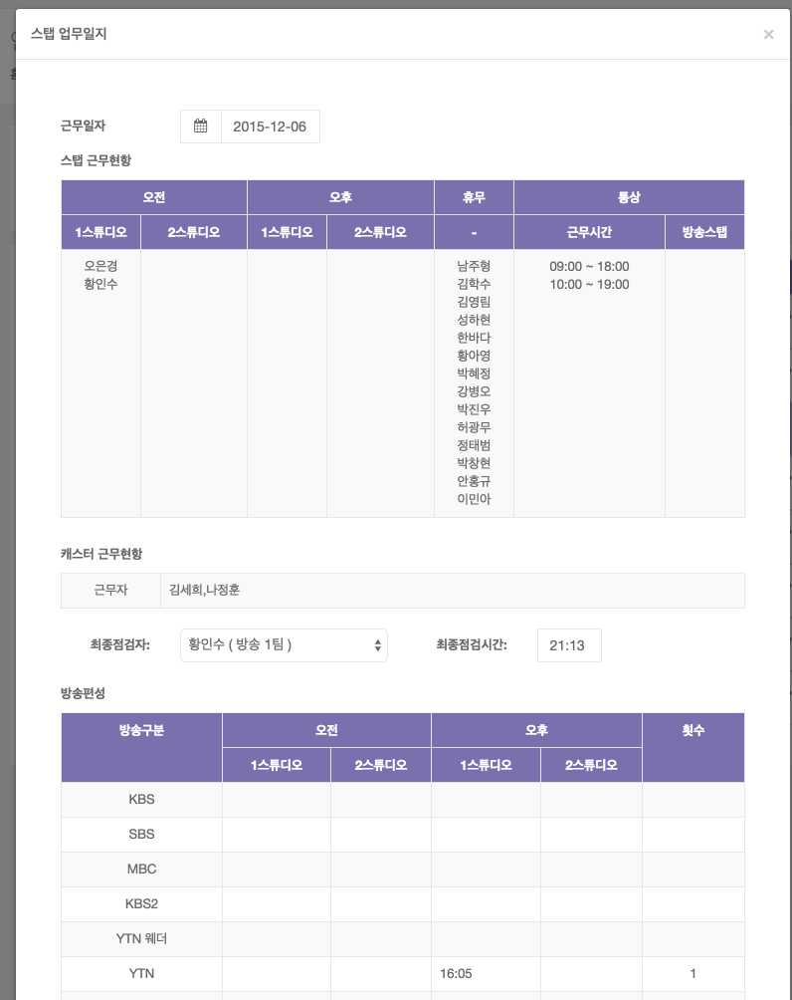

# 스태프

## 스태프 현황

(휴무일 등록 관리) 휴무일은 매년 1회 등록 관리를 해야 함.

- 화면개요
    - 업무 담당자를 등록 수정 삭제 관리하는 화면이다.
- 신규 처리
    - 목록화면에서 [신규] 버튼을 클릭하면 등록 팝업 창이 활성화 된다.  
    - 등록 하고자 하는 담당자의 정보를 입력후 [저장]버튼을 클릭하면 등록된다.
- 상세 정보 확인 처리 
    - 목록화면에서 항목을 선택 한 후 [수정]버튼을 클릭하면 상세정보확인 팝업 창이 활성화 된다. 
    - 수정하고자 하는 항목을 입력하고 [저장]버튼을 클릭하면 수정된다.
- 삭제
    - 상세 정보 처리 화면에서 삭제하고자 하는 경우는 퇴직일자를 입력하고 [저장]버튼을 클릭하면 삭제된다.

## 월 근무표 관리 : 월근무표 작성

- 화면개요
    
    - 근무표를 조회, 생성, 저장, 결재를 처리하는 화면이다.

- 검색항목 설명

    - 근무년월 : 근무년월을 입력한다. 

- 조회 처리

    - 검색하려는 조건을 입력하면 조회 가능.
    - 근무표 승인상태에 따라 표시되는 버튼의 수가 다르다.
        - 이미 존재하고 승인이 완료된 경우 버튼 비활성화.
        - 승인요청을 하지 않거나 반려 된 경우 [저장], [승인요청] 버튼만 표시된다.					
- 생성 처리

    - 일자별 담당를 변경하게 되면 좌측의 휴무자 명단과 상단의 모니터링정보가 반영된다.
    - [저장]버튼을 클릭하면 변경한 정보를 저장하게 된다.

- 결재 처리

    - [저장]후 [승인요청] 버튼을 클릭한 후 승인권자를 선택하여 승인요청을 할 수 있다.
    - 승인권자는 로그인시 본인이 승인해야 할 정보가 월근무표승인메뉴 클릭시 표시된다.
    - 승인요청자는 본인이 승인요청한 정보가 월근무표승인현황메뉴 클릭시 표시된다.

## 월 근무표 승인 : 월근무표 승인 처리

- 화면개요
    - 월근무표승인메뉴는 근무표승인권한을 갖고있는 사용자에게만 표시된다.
    - 본인에게 승인요청이 들어온 것만 표시된다.

- 상세 정보 확인 처리 
    - 목록화면에서 승인내용을 클릭하면 상세정보가 출력된다. 
    - 반려인 경우 반려사유를 반드시 입력하고 [반려]버튼을 클릭하면 상태가 반려로 변경된다.
    - [승인]버튼 클릭시 팝업창이 종료되며 목록화면의 상태가 승인으로 변경된다.

## 일 근무표 관리 : 일근무표 작성

- 화면개요
    - 월근무표승인이 완료된 해당월의 근무표에 대하여 일변경을 처리한다.
    - 해당월의 월근무표가 승인이 되지 않은 경우는 데이터가 표시되지 않는다.
    - 오늘 이전의 근무표는 수정할 수 없다.

- 검색항목 설명
    - 근무년월 : 근무기간을 입력한다. 

- 조회 처리
    - 검색하려는 조건을 입력 하면 조회 가능.

- 수정 

    

    - 조회결과에서 특정일의 담당자를 변경하게 되면 휴무자 정보가 자동 변경된다.	

## 업무 일지 관리 : 업무일지 작성

- 화면개요
    - 업무일지를 등록, 수정, 삭제하는 화면이다. 
- 검색항목 설명
    - 근무년월 :  근무년월을 입력 및 선택 할 수 있다. 
- 일지 등록 처리

    

    - 업무일지 추가를 하고자 할 경우는 [신규] 버튼을 클릭하면 업무일지등록 팝업창이 활성화 된다. 
    - 상단의 근무일자를 입력 및 선택하면 근무일자에 해당하는 근무일지 정보가 조회 된다. 
    - 해당 화면에서 아래와 같은 내용을 처리한다.
        - 근무 현황을 확인 할 수 있다. 
        - 퇴근전 점검사항에서 최종점검자를 선택한다.
        - 최종점검시간을 입력한다. (기본값 : 현재 시간)
        - 점검 사항에 체크 한다. 
        - 방송 횟수 내역을 확인한다.
        - 특이 사항에 [추가]버튼을 눌러 정보를 입력하고 [저장] 버튼을 클릭 하면 
    저장 되고 조회 결과에 반영 된다. 

- 변경처리
    - 조회 결과 중 날짜를 클릭하면 캐스터 근무일지 수정 팝업 창이 활성화 된다. 
    - 변경 내용을 등록 하고 [저장] 버튼을 클릭하면 변경 내용이 저장 되고, 조회 결과가	화면에 반영된다.

- 삭제 처리
    - 조회 결과 중 삭제 할 내용을 선택 후 [삭제] 버튼을 클릭하면 삭제 된다. 

